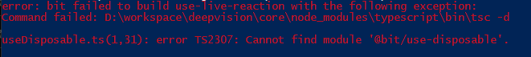
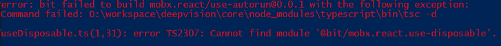

# Error reproduction



```
bit init
bit add src/*
bit tag --all
```

Tried tagging one by one from which has worked out eventually.
But after exporting and then trying to tag again, I ended up with following error even when trying to `bit tag use-disposable`. Not sure why it even mentiones `use-autorun` there if it's supposed to tag only the one bit.


